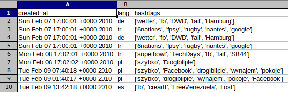
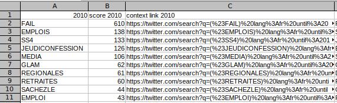
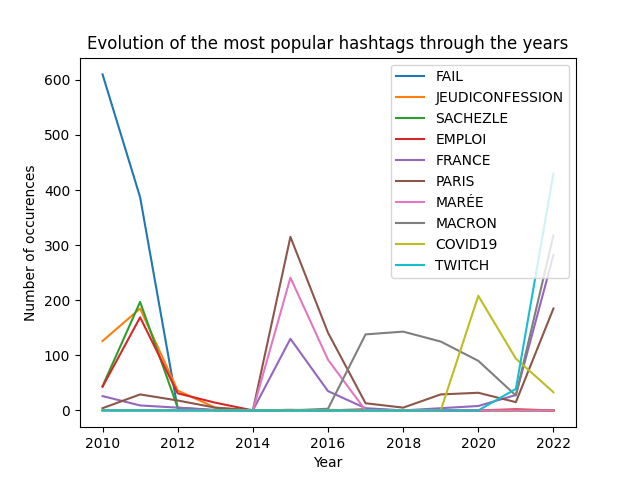

# TweetTrends

TweetTrends is a data engineering project to :

- 🔎 Plot dynamicly graphs on the evolution of most used hashtags in date range or for a specific hashtags
- 📷 Visualize with images the most used hashtags on Twitter from 2010 to 2022

## Description

This project is a data engineering project. The goal is to create an application that uses most used hashtags on Twitter from 2010 to 2022 and do visualizations on them. This way, we can see the evolution of subject on Twitter over the years. This is interresting beaucause, often, it well represents the news of the year. However, it is not a perfect representation of the news because there is a lot of companies that use Twitter to promote their products or also people who are talking about their life.

## Requirements

- `Python 3`
- `pip`

Install all the required libraries with :

```bash
pip install -r requirements.txt
```

## Use the application

TODO

## Development

> To get more details about the scripts, you can go to the [scripts](scripts/tweets/) folder. All the scripts are documented.

### 📕 Data source

The first step was to find a source for Twitter data. For that, we use all the tweets of the Twitter user [TopHashtags](https://twitter.com/TopHashtags). This user has tweeted the most used hashtags approximately about every day since 2010.

There are a few drawbacks to this method of using tweets of `TopHashtags` :

- We don't have the number of occurences of each hashtags
- The year 2014 is almost empty

Despite these drawbacks, we decided to use this method because it was the easiest way to get the data.

### ⚓ Data collecting

For collecting, there was severals solutions :

- Use the Twitter API -> But it is to limited with free account
- Use [Twint](https://github.com/twintproject/twint) -> But we never managed to make it works

Finaly, we used a project inspired by Twint called [Stweet](https://github.com/markowanga/stweet). This library is not as complete as Twint but it was enough for our needs. We used it to get all the tweets of the user [TopHashtags](https://twitter.com/TopHashtags) and save them in a JSON file. This step took about 4 hours to get all the tweets.

### 🚿 Data cleaning

At this step, we had a big JSON file with all the tweets and a plenty of useless informations. So, we needed to clean all of this with a Python script : [tweets_shapping](scripts/tweets/tweets_shaping.py)
On this script, thank's to Pandas, we removed all the useless informations and we kept only the hashtags and the date of the tweet. Then, we saved the result in a CSV file : [tweets.csv](data/tweets/tweets.csv).

Output :



### 🎯 Data processing

Now, we had a CSV file with all the hashtags and the date of the tweet. But, we needed to count the number of occurences of each hashtags for each year. As before, we used a Python script : [process_tweets_data](scripts/tweets/process_tweets_data.py)

This script is a bit more complex than the previous one. In input, we have the csv file [tweets.csv](data/tweets/tweets.csv), and in output, we have another CSV file but this one only has the hashtags, the numbers of occurences per year and a link to an advanced Twitter search with the hashtag and the year. This way, we can see tweets to get more informations about the hashtag.

Output :



### 💎 Data visualization

The next step is to visualize the data. To do that, we used a Python script : [plots_tweets.py](scripts/tweets/plots_tweets.py). On this script, we can specify :

- The number of most popular hashtags
- Hashtags we want search
- Hashtags we want to ignore
- The date range we want to search
- The date range to visualize
- If we want to get only french hashtags (hashtags with french context)

In output, thanks to Matplotlib and Pandas, we get a graph with the evolution of the hashtags over the years : 



## Structure of the project

```text
📦 TweetTrends
┣ 📂data
┃ ┣ 📂 tweets
┃ ┃ ┣ 📜 tweets.csv
┃ ┃ ┗ 📜 most_used_hashtags.csv
┃ ┃ ┗ 📜 tweet_dataset.json
┃ ┃ ┗ 📜 tweets_dataset.json
┣ 📂 scripts
┃ ┣ 📂 tweets
┃ ┃ ┣ 📜 process_tweets_data.py
┃ ┃ ┗ 📜 tweets_shaping.py
┃ ┃ ┗ 📜 plots_tweets.py
┃ ┃ ┗ 📜 scrap_tweets.py
┗ 📜 .gitignore
┗ 📜 README.md
┗ 📜 requirements.md
```

## Limitations and Improvements

### 🚫 Limitations

The project has one big limitations : the data source. Indeed, we used the tweets of the Twitter user [TopHashtags](https://twitter.com/TopHashtags). And as said previously, there are a few drawbacks and limitations to this method.

Except this, the project has not been really limited by anything else.

### 🚧 Improvements

According to the previous part, the main improvement would be to use another source of data. The Twitter API is probably the best solution if it is possible to pay for it. Otherwise, we can try to find another Twitter user that tweets the most used hashtags every day, or an already existing dataset.
